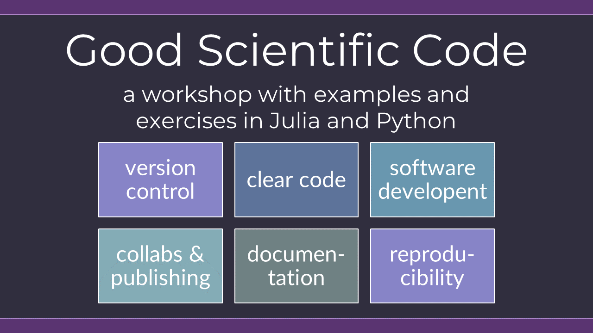

# Good Scientific Code Workshop

## Elevator Pitch

> _Scientific code is notorious for being hard to read and navigate, difficult to reproduce, and badly documented. One reason leading to this situation is that curricula that traditionally train scientists do not explicitly treat writing good code, and during the scientific life there is little time for the individual to practice this on their own. In this intensive two-day-block-workshop we will change that and teach you all you need to know to write code that is **Clear, Easy to understand, Well-documented, Reproducible, Testable, Reliable, Reusable, Extendable, and Generic.**_
>
> _Sounds too good to be true…? Join this workshop, and you will be surprised to find out that attributing all these properties to your code does not take much effort; once you have the proper education on the subject, you get all of this good stuff practically for free!_

## Information
This repository contains materials for the "Good Scientific Code" workshop.
It is a (mostly) language-agnostic workshop, meaning that the principles are about general coding. Examples and exercises will be in Julia and Python.

This workshop is an intensive two-days, six-blocks course. It was developed over 3 years by [George Datseris](https://github.com/Datseris/), combining textbooks, other workshops, online tutorials from field experts, blog posts, personal experience developing and documenting 10+ software, and research on how to make reproducible science.

[Lukas Kluft](https://github.com/lkluft/) helped the workshop substantially by providing several Python examples, translating Julia code to Python, and reviewing the slides.

## Contents

The workshop is divided into the following six blocks:

- **Version control**: retraceable code history using git
- **Clear code**: write code that is easy to understand and reason for
- **Software developing paradigms**: write your code like a software developer
- **Collaboration & publishing code**: modern team-based development on GitHub
- **Documenting software**: documentation that conveys information efficiently and intuitively
- **Scientific project reproducibility**: publish reproducible papers

## Bring your own code!
The exercise sessions have two components. On the first, illustrative but simple exercises are given to the participants to practice each topic. Participants are expected to solve the exercises live during the workshop! The second component requires the participants to apply this new knowledge to their very own code base. Therefore, please bring along all code you have used in your latest published paper. If you haven’t published yet, no worries, bring along all the code you have at the moment for your science project. Decide in advance on 2-3 figures of your paper/project, which will be the central focus of the exercises. The exercise plan will transform your code from random scripts to a self-contained code base that is understandable, extendable, continuously tested, documented, and hosted on open and accessible platforms.

_Note: for this plan to have meaningful impact, you should bring a code base where you had to write a substantial amount of source code._